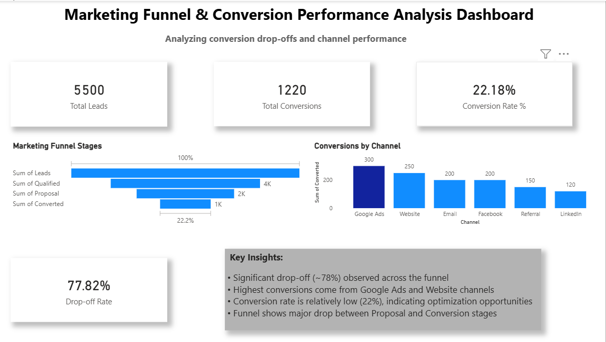
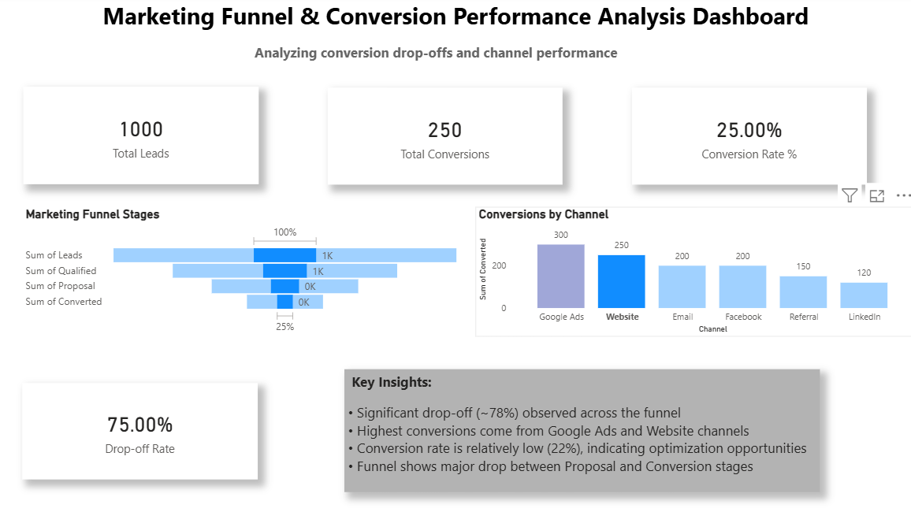
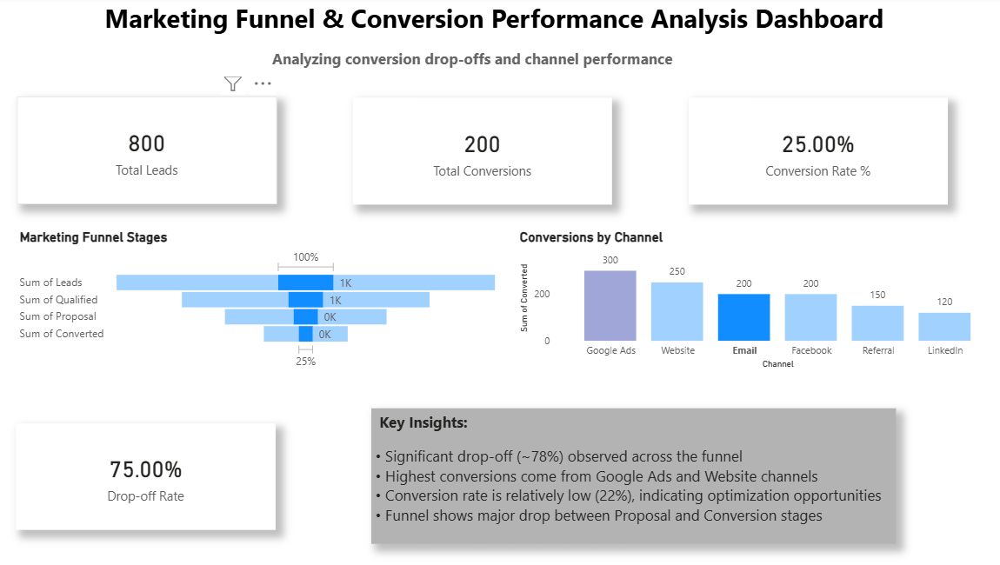
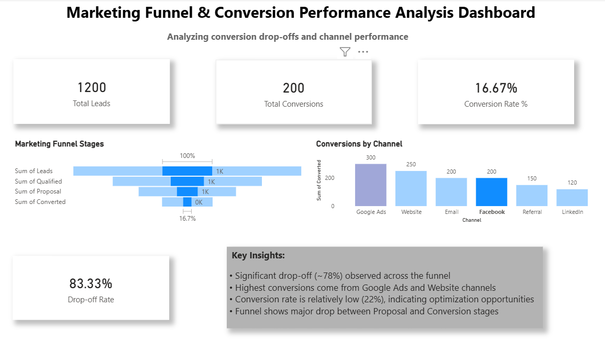
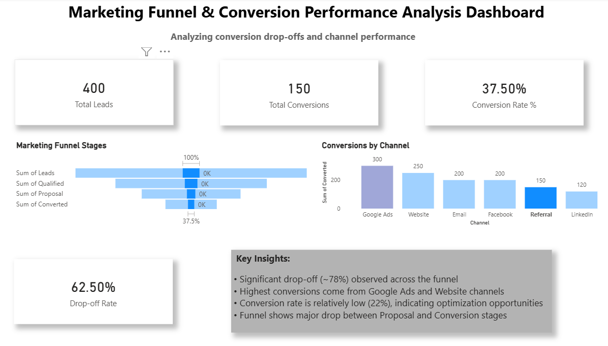

# 📊 Marketing Funnel & Conversion Performance Analysis  
### Data Science & Analytics — Task 3 (2026) | Future Interns  

---

## 📌 Objective  

The goal of this task is to analyze marketing funnel data and understand how users move from **visitors → leads → customers**, and identify areas where conversions can be improved.

This analysis helps answer key business questions:

- Where are users dropping off in the funnel?  
- Which channels bring high-quality leads?  
- How can conversion rates be improved?  
- Which stages require optimization?  

---

## 🛠️ Tools & Technologies  

| Tool | Purpose |
|---|---|
| **Power BI Desktop** | Dashboard creation & interactive visualization |
| **Custom Marketing Funnel Dataset** | Funnel stage & channel performance analysis |

---

## 📂 Dataset  

- **Name:** Marketing Funnel Dataset  
- **Type:** Simulated dataset representing real-world marketing funnel  
- **Scope:**  
  - Leads  
  - Qualified Leads  
  - Proposals  
  - Conversions  
  - Marketing Channels (Google Ads, Website, Email, Facebook, Referral, LinkedIn)  

---

## 🔧 Data Preparation & Transformations  

The dataset was cleaned and transformed to ensure accurate analysis and meaningful insights:

- Removed unnecessary or irrelevant columns  
- Checked and handled missing/null values  
- Renamed columns for better readability  
- Verified and corrected data types (numeric, categorical)  
- Ensured consistency in funnel stages and channel names  
- Structured the dataset to represent proper funnel flow  

### 📐 DAX Measures Created  

- **Total Leads** = SUM(Leads)  
- **Total Conversions** = SUM(Converted)  
- **Conversion Rate (%)** = DIVIDE(Total Conversions, Total Leads, 0)  
- **Drop-off Rate (%)** = 1 - Conversion Rate  

These transformations helped in building a clean, reliable, and insight-driven dashboard.

---

## 📊 Dashboard Overview  

The interactive Power BI dashboard provides a complete view of funnel performance and conversion behavior:

---

### 📌 KPI Summary Cards  

| Metric | Description |
|---|---|
| Total Leads | Total number of leads generated |
| Total Conversions | Number of successful conversions |
| Conversion Rate | % of leads converted |
| Drop-off Rate | % of users lost in funnel |

---

### 📉 Marketing Funnel Stages  

A funnel visualization showing how users move through stages:

- Leads → Qualified → Proposal → Converted  

This helps identify **where maximum drop-offs occur**.

---

### 📊 Conversions by Channel  

Channel-wise performance comparison:

- Google Ads  
- Website  
- Email  
- Facebook  
- Referral  
- LinkedIn  

Helps identify **top-performing marketing channels**.

---

### 💡 Key Insights  

- 🚨 Significant drop-off (~75–80%) observed across the funnel  
- 📊 Google Ads and Website generate the highest conversions  
- 📉 Conversion rate indicates optimization opportunities  
- ⚠️ Major drop-off occurs between Proposal and Conversion stages  

---

## 💡 Business Recommendations  

- Improve conversion strategies at the final stages of the funnel  
- Focus on high-performing channels like Google Ads  
- Optimize proposal-to-conversion process  
- Enhance lead nurturing and targeting strategies  

---

## 📸 Dashboard Preview  

  
  
  
  
  
 

---

## 📂 Project Files  

| File | Description |
|---|---|
| `Marketing_Funnel_Dashboard.pbix` | Power BI dashboard file |
| `marketing_funnel_dataset.csv` | Dataset used for analysis |
| `Dashboard-1.jpeg` | Dashboard view 1 |
| `Dashboard-2.jpeg` | Dashboard view 2 |
| `Dashboard-3.jpeg` | Dashboard view 3 |
| `Dashboard-4.jpeg` | Dashboard view 4 |
| `Dashboard-5.jpeg` | Dashboard view 5 |

---

## 🔗 Internship  

This project was completed as part of the **Future Interns — Data Science & Analytics Internship Program (2026)**.  

👉 https://www.linkedin.com/company/future-interns/  

---

## 📢 Conclusion  

This task highlights how marketing funnel analysis plays a crucial role in improving conversion rates and business growth.  

By identifying drop-off points and high-performing channels, businesses can take **data-driven actions** to optimize marketing strategies and increase revenue.

---

## 👩‍💻 Author  

**Karishma S**  
Aspiring Data Analyst | Power BI | Data Analytics  

---

⭐ If you found this useful, feel free to star the repo and share your feedback!
